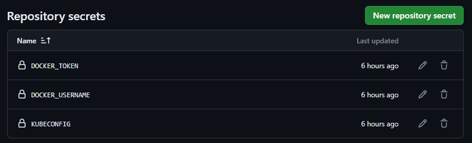

# RETO WHITESTACK - MILUNA


## PROCESOS DEL RETO
### Cambios en el codigo fuente
Para poder hacer dinamico el despliegue de la aplicacion ante cambios en el puerto se modifico el codigo de 'application.py' para que pueda recuperar tanto el puerto como el host de un archivo de variables '.env'.
```bash
#Cargar variables de ambiente para el puerto e IP desde ../.env
dotenv_path = os.path.join(os.path.dirname(__file__), '.env')
load_dotenv(dotenv_path)
.
.
.
## Obtener el puerto e IP de variables en .env, o tomar valores por defecto.
if __name__ == '__main__':
    app.debug = True
    host = os.getenv('HOST', '0.0.0.0')   
    port = int(os.getenv('PORT'))
    print(f"Starting server on {host}:{port}")
    socketio.run(app, host=host, port=port)
```
### Dockerizar la aplicacion 🐋🐋
Luego de probar localmente, fue momento de dockerizar la aplicacion, este es el Dockerfile dentro de la carpeta tengen-tetris donde esta la aplicacion.

```dockerfile
# Uso una imagen base de Python 3
FROM python:3.8-slim
WORKDIR /app
# Instalar las dependencias de Python
RUN pip3 install flask flask_socketio gevent-websocket python-dotenv
# Copiar el código fuente del proyecto en el contenedor
COPY . /app
# Exponer el puerto que quier para el servidor Flask
EXPOSE 5000
# Comando para iniciar la aplicación
CMD ["python3", "application.py"]
```

Para probar localmente al momento de construir el contenedor debemos pasarle como argumento el numero de puerto.
```bash
docker build --build-arg PORT=${{ env.PORT }} -t milunadev/tetrischallenge:latest
```
🐋 Luego de esto subi la imagen con v0 a mi repositorio publico: 
https://hub.docker.com/r/milunadev/tetrischallenge/tags


## Crear manifiestos de Kubernetes

Ahora que ya tenemos todo contenerizado y en el repositorio es momento de levantar el cluster de Kubernetes en el nodo!
Para esto cree los manifiestos de la carpeta [k8s_manifiestos](./k8s_manifiestos/) los que son:

- **ingress.yml**:  Este manifiesto define las reglas de entrada para acceder a los servicios dentro del clúster. Establece un punto de acceso mediante un hostname específico que dirigirá el tráfico entrante hacia el servicio tetris-service en el puerto que escoja, permitiendo el acceso a la aplicación Tetris a través del path /.

- **manifiesto_v1.yml**: Este archivo contiene dos manifiestos:
    - **Deployment:** Define un despliegue llamado tetris-deployment que asegura que siempre haya dos réplicas de la aplicación Tetris ejecutándose. Cada réplica es un pod que contiene un contenedor basado en la imagen milunadev/tetrischallenge:v0, escuchando en el puerto escogido.
    - **Service:** Crea un servicio de tipo ClusterIP llamado tetris-service, que permite el acceso al despliegue tetris-deployment. Este servicio abstrae las réplicas del despliegue y proporciona una IP interna fija a la cual se puede enviar tráfico en el puerto escogido.

Para desplegar la infraestructura Kubernetes en el cluster que especificamos en los manifiestos:

```bash
kubectl apply -f manifiest0_v1.yml
kubectl apply -f ingress.yml
```


## Empaquetar la aplicacion con Helm

⚓ Para facilitar el despliegue y la gestión de nuestra aplicación Tetris en Kubernetes, hemos empaquetado la aplicación utilizando Helm, el gestor de paquetes para Kubernetes. El chart de Helm se encuentra en la carpeta [tetris-mluna-chart](./tetris-mluna-chart/), que contiene todos los archivos necesarios para definir y configurar los recursos de Kubernetes necesarios para la aplicación.

👀 El archivo más significativo dentro de este chart es el **values.yaml**, donde podemos costumizar parametros importantes como el puerto donde corre el contenedor, que es lo que nos interesa 👀.

```yaml
service:
  type: ClusterIP
  port: 5000

app:
  name: tetris
  image: milunadev/tetrischallenge:latest
  replicas: 2
  containerPort: 5000

  ingress:
    enabled: true
    host: "tetris-challenger006.whitecruiser.201.217.240.66.nip.io"
    path: "/"
    pathType: Prefix
    servicePort: 5000
```

- **service:** Define las especificaciones del servicio que expondrá nuestra aplicación. Utiliza el tipo ClusterIP para una exposición interna en el clúster y escucha en el puerto 5000.
- **app:** Contiene la configuración principal de la aplicación Tetris:
    - **name:** Nombre de la aplicación, que se utilizará en diferentes recursos como etiquetas y nombres de recursos.
    - **image:** Ubicación de la imagen Docker en Docker Hub que se utilizará para los pods del despliegue. Aquí se utiliza la etiqueta latest, que deberá apuntar siempre a la última versión estable de la imagen.
    - **replicas:** El número deseado de réplicas de la aplicación que Helm asegurará mantener en ejecución.
    - **containerPort:** El puerto dentro del contenedor que la aplicación utiliza para recibir tráfico.
- **ingress:** Configuración del recurso Ingress, que permite acceder a la aplicación desde fuera del clúster.
    - **enabled:** Esta bandera habilita o deshabilita la creación del recurso Ingress.
    - **host:** El hostname que se utilizará para acceder a la aplicación desde fuera del clúster.
    - **path:** Define el path en el hostname donde la aplicación será accesible.
    - **pathType:** Tipo del path para el Ingress, en este caso Prefix, que indica que cualquier ruta con este prefijo será dirigida a la aplicación.
    - **servicePort:** El puerto al que el servicio Ingress enviará el tráfico entrante, que debe coincidir con el puerto expuesto por el servicio.

    ```bash
    helm install my-tetris ./tetris-mluna-chart
    ```

    Esto hara que la aplicacion ya este en funcionamiento en el endpoint: http://tetris-challenger006.whitecruiser.201.217.240.66.nip.io:8080/

## Construccion del pipeline CI/CD 

Ya que el requerimiento pedia actualizar el puerto donde se levantaba la aplicacion, esto haria que tengamos que construir nuevamente el contenedor, enviar la imagen a DockerHub y luego generar y desplegar nuevas versiones de los manifiestos y el chart, pero todo esto manualmente 🫱🫱.
Para evitar esto elabore un pipeline en Github Action, el cual se dispara cuando hay cambios en el archivo **.env** donde definimos el puerto y host.

📌📌 Importante: Se deben setear los siguientes secretos en Actions.


Aqui algunos pasos del pipeline:
- **Set .env and Write Dockerfile:** Extrae el valor del puerto de la aplicación del archivo .env y lo utiliza para configurar el Dockerfile a traves de un script de bash.

- **Setup Docker Buildx:** Configura Buildx, que es una extensión de los comandos de build de Docker.

- **Login to Docker Hub:** Se autentica en Docker Hub para poder subir la nueva imagen del contenedor construido.

- **Build and Push Docker Image:** Construye la imagen Docker con el nuevo puerto y la sube a Docker Hub milunadev/tetrischallenge etiquetada como latest.

- **Update Helm values.yaml with New Port:** Actualiza el archivo values.yaml del chart de Helm con el nuevo puerto a traves de un script bash.

- **Install Helm y configure Kubeconfig:**  Instala la herramienta de Helm y configura el acceso al cluster de Kubernetes usando un archivo kubeconfig almacenado como un secreto en GitHub.

- **Create or Update Helm Release:** Verifica si ya existe una versión desplegada de la aplicación en el namespace challenger-006:
    - Si existe, realiza una actualización (helm upgrade --install) del despliegue con los valores y configuración actualizados.
    - Si no existe, realiza un nuevo despliegue (helm install) de la aplicación en el cluster de Kubernetes.

### DISPARO DEL PIPELINE:
Haremos un cambio en el archivo .env, cambiare el puerto a 9000 y esto hara un trigger del pipeline, en este corto video expico el funcionamiento 😃😃😃:

[](https://youtu.be/oGvC_9nYjyM)